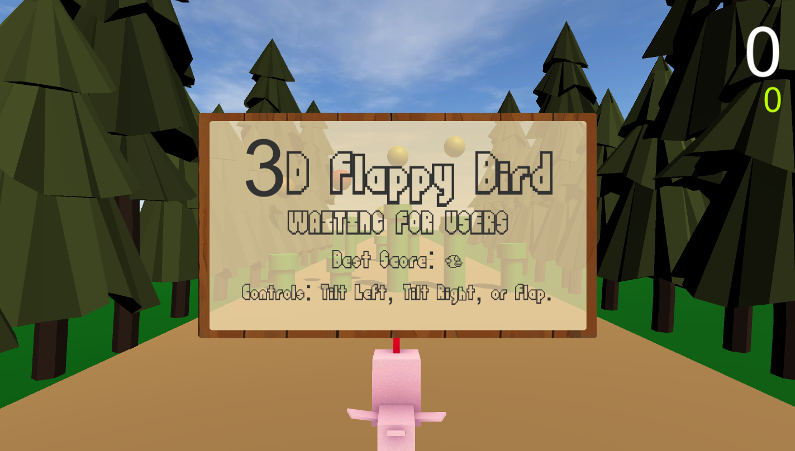

# 3D Flappy Bird

### Authors: Jessica Yang and Yanni Wang

## Demo Video

# Table of Contents
## Assets
This folder contains most files that are used in the game, including 3D assets, files for gesture recognition, and files that facilitate game logic.
### GameScripts
#### Audio
Contains sound effects used in-game, including background music, collectible collision sound, obstacle collision sound, and gameover sound.
* bgm.wav
* collect.mp3
* flap.mp3
* gameover.mp3
#### Collectibles
Contains prefab game objects that are used for collectible spheres.
* Sphere1.prefab, Sphere2.prefab, Sphere3.prefab, Sphere4.prefab, Sphere5.prefab
#### Materials
Contains materials and images used for coloring collectible spheres and the menu panel in the game.
* DarkGreenMaterial.mat, GreenMaterial.mat, LightBrownMatreial.mat, LightGreenMaterial.mat, OrangeMaterial.mat, PurpleMaterial.mat, RedMaterial.mat, YellowMaterial.mat, wood_panel.png
#### Obstacles
* GreenPipe.prefab: Asset used for obstacles in the game.
#### Files
* BirdMovement.cs: Script that moves the bird (player) forward.
* CanvasController.cs: Script that activates / deactivates the text panel that appears when the game is not being played.
* Collectible.cs: Script attached to collectible objects in-game (color spheres) to move objects out of the player’s view and to increase the player’s score upon collision.
* Constants.cs: Contains constants used throughout our project.
* DebugOnly.cs: Script used to set game objects to inactive (not not visible) if the IS_DEBUG is false in Contants.cs
* GameLevelCamera.cs: Script that moves the game camera forward.
* GameManager.cs: Singleton instance that contains information about the current game state and also contains functions to change the game state.
* GameState.cs: Defines the possible game states (Start, Playing, Dead).
* MenuPanel.cs: Script attached to the menu panel (shown when not playing) that updates texts on the panel.
* ObjectDestroyer.cs: Script that destroys objects after a certain timeout, attached to objects that are generated continuously (e.g. paths, obstacles, and collectibles).
* ObjectGenerator.cs: Script that generates objects, both collectibles and obstacles.
* PathGenerator.cs: Script that generates new paths (to create an endless path effect).
* UIManager.cs: Singleton instance that contains information about the player’s score and best score. Also contains Text objects of scores for displaying in the game’s UI.

### Imported Assets
#### Fonts
* FlappyBirdy.ttf: The Flappy Bird font.
#### LowPolyTreePack
* 3D tree assets downloaded from Unity store.
#### Wispy sky
* 3D skybox asset downloaded from Unity store.
#### _Gloomy_Animal
* 3D animal assets downloaded from Unity store.

### KinectScripts
* Kinect SDK asset downloaded from Unity store. Contains files that maps Kinect inputs to 
bone for 3D humanoid assets. Also contains KinectManager and associated files (KinectWrapper.cs, AvatarController.cs, etc.), which are used for gesture recognition / avatar movements and modified for the purpose of our project. 
#### Filters
Files used by the SDK to smooth inputs from the Kinect and map Kinect inputs to bones for 3D humanoid characters in Unity.
* BoneOrientationsConstraint.cs,  BoneOrientationFilter.cs, ClippedLegsFilter.cs, JointPositionsFilter.cs, KinectHelper.cs, SelfIntersectionContraint.cs, TimedLerp.cs, TrackingStateFilter.cs
#### Files
* AvatarController.cs: Script that controls the player’s avatar (bird) by responding to gestures recognized by the KinectManager. Moves the player up if the player has flapped, left if the player tilts left, and right if the player tilts right.
* KinectGestures.cs: Customizable script that recognizes gestures. Flap, tilt left, and tilt right were added to this script.
* KinectManager.cs: Singleton instance that manages all Kinect activity and passes needed information to the player’s avatar to facilitate player movements.
* KinectWrapper.cs: Wrapper class that holds all the user's Kinect skeleton data
* SimpleGestureListener.cs: Customizable script that listens for tilt/flap gestures and detects whether the gesture is in progress, has been completed, or was cancelled

### Scenes
* GameLevel.unity: Contains our game scene, where our game takes place in Unity.

### Meta Files
Multiple meta files are included in this project, which are automatically generated and used by Unity to prepare assets in our game.

 ## Settings Files
These files are generated automatically for project settings or used for ignoring files when using version control.
* vscode, Packages, ProjectSettings.collabignore, .gitignore

# Instructions for Setting Up and Running Project
## Tools and Libraries
* OS: Windows 10 (most likely works on Windows versions, but we used Windows 10)
* Kinect v1
* [Kinect SDK v1.8](https://www.microsoft.com/en-us/download/details.aspx?id=40278)
* [Unity 2019.3.8f1](https://unity3d.com/get-unity/download/archive) 
* Unity Assets (already included in Github repo, don’t need to download)
    * [Kinect with MS-SDK](https://assetstore.unity.com/packages/tools/kinect-with-ms-sdk-7747)
    * [Low Poly Tree Pack](https://assetstore.unity.com/packages/3d/vegetation/trees/low-poly-tree-pack-57866)
    * [Free Low Polygon_Animal](https://assetstore.unity.com/packages/3d/characters/animals/free-low-polygon-animal-110679)
    * [Wispy Skybox](https://assetstore.unity.com/packages/2d/textures-materials/sky/wispy-skybox-21737)
    * [Flappy Birdy (Font)](https://www.dafont.com/flappybirdy.font)

## Steps to run code
1. Download code from Github or clone this repository.
2. Install all tools/libraries for the section above (except the Unity Assets section).
3. Open the project folder in Unity (build 2019.3.8f1). Alternatively, if you already have Unity, you can try opening Assets/Scenes/GameLevel.unity, but this may raise a prompt to update game files if you have a different Unity build, which may cause issues.
4.  Hit the “Play” button in the top middle of the Unity editor.

5.  Enjoy the game!

## Controls
* Tilt left: Extend both arms, then raise right arm up and left arm down to create a slope.

* Tilt right: Extend both arms, then raise left arm up and right arm down to create a slope.

* Flap: Move both arms up then down to move up.

## Gameplay
* Flap your arms to start the game.
* Collect collectibles (colored spheres) to earn points, located at the top right-hand corner.
* Avoid obstacles (green pipes) at all costs (or else it’s game over).
* Try to beat your best score, the green number underneath your current score.

